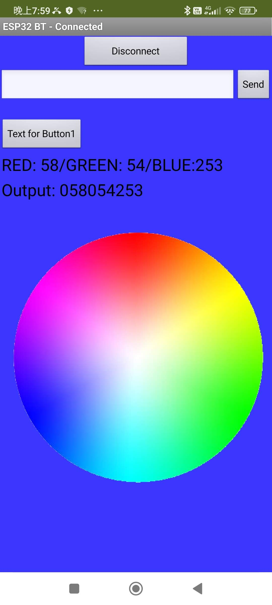
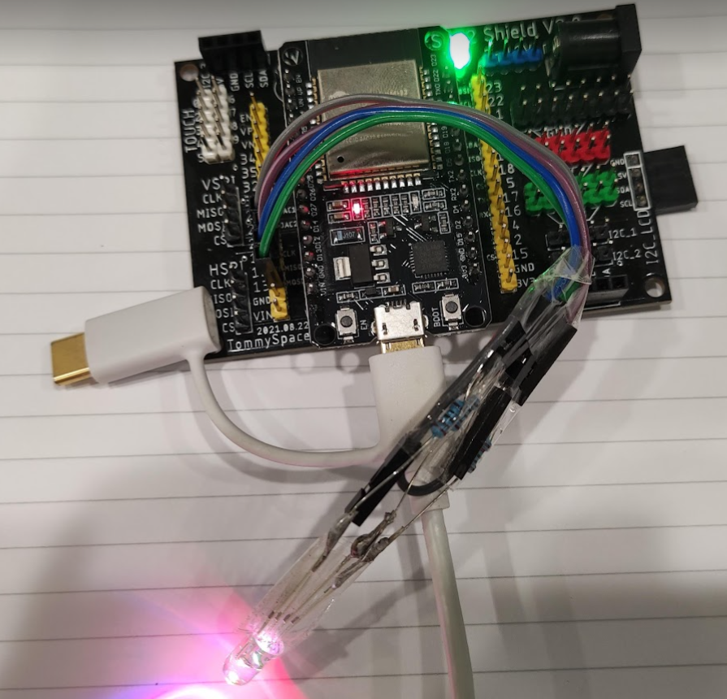
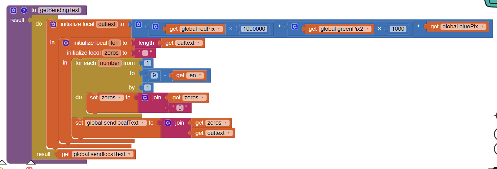

# Esp32ColorWheel
Esp32 Receive Color Channels from App Inventor 2 and show corresponding color in RGB LED

The Android App is written By App Inventor 2 named ESP32_ColorWheel hosted in AI2 logined by zebramc36001@gmail.com

# Additional boards manager URLs:

https://raw.githubusercontent.com/espressif/arduino-esp32/gh-pages/package_esp32_index.json
